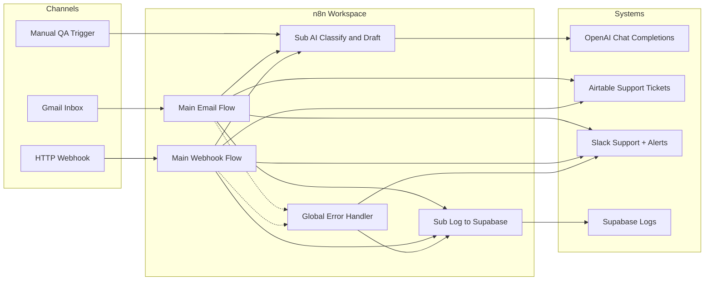

# Architecture — AI Customer Support Automation

## System context



## Decision policy

| Confidence | Action |
|---|---|
| `>= $vars.CONFIDENCE_THRESHOLD` (default 90) | Auto-send Gmail reply, mark Airtable **Auto Replied**, log to Supabase |
| `< threshold` | Slack notification with draft + Approve/Reject links, Wait webhook, then send or park |

## Data contracts

### AI subworkflow input

```json
{
  "ticket_id": "TKT-...",
  "customer_name": "string",
  "customer_email": "string",
  "subject": "string",
  "body": "string",
  "channel": "email|webhook|manual"
}
```

### AI subworkflow output

```json
{
  "category": "Billing|Technical Support|Sales|Refund|General Inquiry",
  "confidence": 0,
  "priority": "Low|Medium|High|Urgent",
  "ai_summary": "string",
  "ai_response_subject": "string",
  "ai_response": "string",
  "auto_reply_eligible": true
}
```

## Failure modes

| Failure | Handling |
|---|---|
| OpenAI timeout / 5xx | Node retry (3x) → error workflow |
| Airtable write fail | Node retry (3x) → error workflow |
| Slack unreachable | `continueOnFail` on error alerts; ticket still logged when possible |
| Human never clicks approval | Execution stays **Waiting**; visible in n8n Executions |

## Security notes

- No API secrets are embedded in workflow JSON
- Supabase writes use **service role** via n8n Variables
- Gmail / Slack / Airtable / OpenAI use n8n credential store
- Webhook path should be activated only after adding auth (header secret) in production
