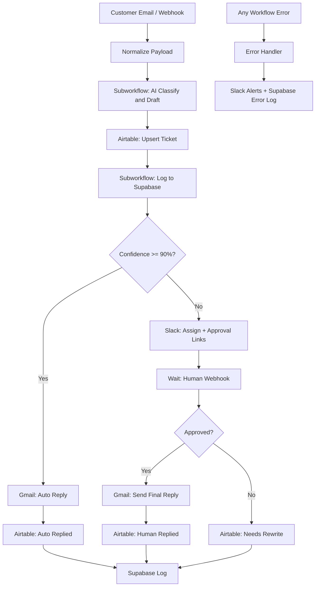

# AI Customer Support Automation (n8n)

Production-ready n8n system that classifies inbound support messages with OpenAI, stores tickets in Airtable, auto-replies above 90% confidence, routes low-confidence cases to Slack for human approval, and logs everything to Supabase.

## Architecture



## Workflows imported into n8n

| Folder | Workflow | ID | Role |
|---|---|---|---|
| 01 · Core | Sub · AI Classify & Draft Response | `aicsClassifySub1` | Reusable AI |
| 01 · Core | Sub · Log to Supabase | `aicsLogSupabase2` | Reusable logging |
| 01 · Core | Error · AI Support Global Handler | `aicsErrorHandler` | Global errors |
| 02 · Channels | Main · Email AI Customer Support | `aicsMainEmailWf` | Gmail production |
| 02 · Channels | Main · Webhook AI Customer Support | `aicsWebhookFlow` | HTTP production |
| 03 · Testing | Test · Manual AI Support QA | `aicsManualTestW` | Fixture tests |

## Quick start

1. Open n8n at [http://localhost:5678](http://localhost:5678)
2. Create credentials listed in [`credentials/ENV_AND_CREDENTIALS.md`](./credentials/ENV_AND_CREDENTIALS.md)
3. Set Variables (same doc)
4. Create Airtable base using [`docs/AIRTABLE_SCHEMA.md`](./docs/AIRTABLE_SCHEMA.md)
5. Open **Test · Manual AI Support QA** → Execute (validates OpenAI + Supabase)
6. Activate **Main · Email…** and/or **Main · Webhook…**

### Webhook test

```bash
curl -X POST http://localhost:5678/webhook-test/ai-customer-support \
  -H "Content-Type: application/json" \
  -d @test-data/webhook-payload.json
```

## Repository layout

```
n8n-ai-customer-support/
├── README.md
├── ARCHITECTURE.md
├── manifest.json
├── workflows/                 # Importable n8n JSON
├── credentials/
├── docs/
├── test-data/
├── screenshots/
└── scripts/
```

## Production hardening included

- Named nodes + sticky-note documentation on canvas
- Reusable subworkflows (AI + logging)
- Global error workflow with Slack alerts
- Node-level retries on OpenAI / Airtable / Gmail / Slack
- Confidence gate via `$vars.CONFIDENCE_THRESHOLD`
- Human-in-the-loop Wait webhook (Approve / Reject links in Slack)
- Supabase `support_tickets` + `support_execution_logs` (already migrated)

## Supabase

Project: `Mymainportfolio` → `https://ltwohsvgafjtxdgypmyh.supabase.co`

Tables created via migration `create_support_automation_logs`.
